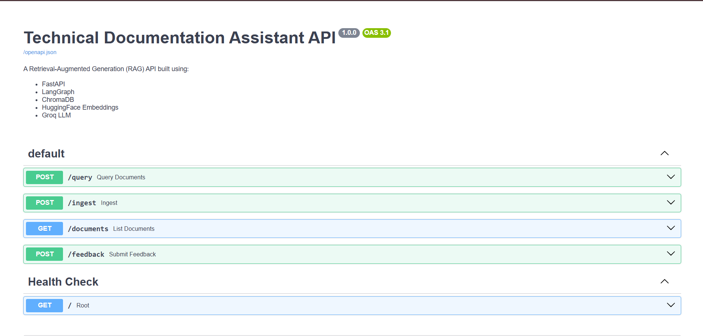
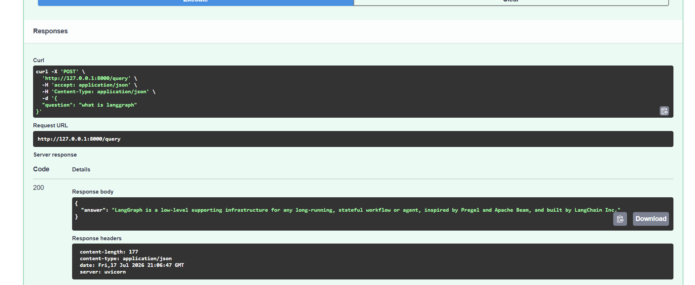

# RAG-Based Technical Documentation Assistant

A Retrieval-Augmented Generation (RAG) based Technical Documentation Assistant built using **LangGraph**, **FastAPI**, **ChromaDB**, **HuggingFace Embeddings**, and **Groq LLM**.

This project was developed as part of the **Express Analytics AI/ML Engineer Internship Assignment**.

---

# Features

- Document ingestion from Markdown, Text, HTML, and PDF files
- Automatic document chunking
- HuggingFace sentence-transformer embeddings
- ChromaDB vector database
- Semantic document retrieval
- LLM-based document relevance grading
- Automatic query rewriting when relevant documents are not found
- Context-aware answer generation using Groq LLM
- REST APIs using FastAPI
- Interactive Swagger API documentation

---

# Tech Stack

- Python
- FastAPI
- LangGraph
- ChromaDB
- HuggingFace Embeddings
- Groq (Llama 3.3 70B Versatile)
- LangChain

---

# Project Architecture

```
                 User Query
                      │
                      ▼
             Query Analysis Node
                      │
                      ▼
              Document Retrieval
                      │
                      ▼
             Document Grading Node
             │                    │
             │ Relevant           │ Not Relevant
             ▼                    ▼
      Answer Generation     Rewrite Query
             ▲                    │
             └────────Retrieve Again
```

---

# Project Structure

```
express_analytics_kunal/

│── app/
│   ├── api/
│   ├── generation/
│   ├── graph/
│   ├── ingest/
│   ├── loaders/
│   ├── retrieval/
│   └── utils/
│
│── data/
│   ├── chroma_db/
│   └── docs/
│
│── main.py
│── test_ingestion.py
│── requirements.txt
│── README.md
│── .env
```

---

# Installation

Clone the repository

```bash
git clone <repository-url>

cd express_analytics_kunal
```

Create virtual environment

```bash
python -m venv venv
```

Activate virtual environment

Windows

```bash
venv\Scripts\activate
```

Install dependencies

```bash
pip install -r requirements.txt
```

Create a `.env` file

```text
GROQ_API_KEY=your_api_key
```

---

# Running the Project

### Step 1

Generate document embeddings

```bash
python test_ingestion.py
```

### Step 2

Run FastAPI server

```bash
uvicorn main:app --reload
```

Swagger UI

```
http://127.0.0.1:8000/docs
```
# Screenshots

## Swagger UI



## Query API Response



---

---

# API Endpoints

## POST /query

Ask questions from the indexed documentation.

Example

```json
{
    "question":"What is FastAPI?"
}
```

---

## POST /ingest

Indexes all documents inside `data/docs`.

---

## GET /documents

Returns all available documents.

---

## POST /feedback

Submit user feedback.

---

# Sample Queries

```
What is FastAPI?

What is LangGraph?

What is Pydantic?
```

---

# Future Improvements

- Response source citations
- Hybrid Search (BM25 + Vector Search)
- Memory support
- Hallucination detection
- Streamlit UI
- Authentication
- Docker deployment

---

# Notes

If the documents inside `data/docs` are modified or new documents are added:

1. Delete the contents of the `data/chroma_db` directory.

2. Run

```bash
python test_ingestion.py
```

to regenerate the embeddings and rebuild the Chroma vector database.

---

# Author

Kunal Bhushan